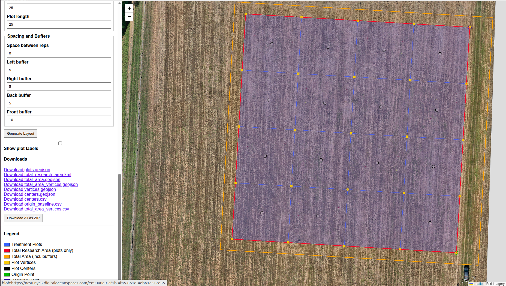

# rplt - Research Plot Layout Tool
Research Plot Layout Tool for replicated agricultural field trials. 

A **web-based interactive tool** for quickly creating replicated agricultural field trials. Plot layouts are displayed directly on satellite imagery or a custom zxy tiled map. Perfect for field trial planning. 

This tool coupled with a [SprakFun Facet and SW Maps](https://learn.sparkfun.com/tutorials/sparkfun-rtk-facet-hookup-guide/all) allows for rapid and accurate plot layout in the field.

Use 'total_research_area.kml' to plan drone missions to monitor the trial during the growing season. THis file can be loaded into a DJI Mavic 3 Multispectral from a SD card and used as the boundary for flight missions. Be sure to set the margin in the advanced settings so their is sufficiuent overlap at the edges of the trial for good orthomosaic reconstruction.  

If applying treatments with a spray drone or percision ag equipement the plot ploygons can be used as field boundaries to program the application equipement. If need to be sure to plan a buffered area to clean out and prime the srpay drone or application equipement between treatment applications. 

When analysing data, plot boundaries are already defined and should shorted the initial analysis.

This is tool is a perfect companion for QGIS or other GIS tool. This provides a starting place to rapidly layout field trials and program drones.

## Summary of work flow 

— define your origin, baseline, plot dimensions, treatments, replications, buffers, and generate GIS-ready files instantly.

---

## 🌟 Features

- **Interactive Map Interface** with Esri World Imagery (or custom tile layers)
- **Click-to-place** Origin and Baseline points (or use points collected from the field with a GPS)
- Support for **metric** and **imperial** units
- Multiple **plot numbering schemes**: Row-major, Column-major, Snake
- Configurable **buffers** (left/right/front/back) and **replication gaps**
- Two **origin reference modes**:
  - Lower-left of first plot (101)
  - Lower-left of entire area (including buffers)
- **Real-time visualization** of:
  - Individual treatment plots
  - Total research area
  - Full buffered area
  - Plot centers & vertices
- **Export multiple formats**:
  - GeoJSON (plots, centers, vertices, total area)
  - KML (total research area)
  - CSV (centers, origin/baseline, vertices)
- **Download all files individually or as ZIP**

---

## 🚀 Live Demo

Try it now: [research-plot-layout-tool](https://ncsu.nyc3.digitaloceanspaces.com/d2lf.html) 

**Demo Data** - Use the data below to experiment with the tool. See the screenshots below for examples using this demo data. 
- Custom Map: https://miguel.nyc3.digitaloceanspaces.com/{z}/{x}/{-y}.png
- Zoom location: 35.731585,-78.702636
- Origin: 35.731086,-78.701864
- Baseline: 35.731985,-78.701798

---

## 📸 Screenshot

> *Example layout 4 treatments × 4 replications, 25m x 25m plots, 5m buffers with 10m on plot front, and 'Row-major numbering*

---

## 🛠️ How to Use

1. **Load custom tiles** (optional) — e.g., drone orthomosaics or high-res imagery
2. **Set Origin & Baseline**:
   - Click **"Set Origin (click map)"** → click lower-left corner
   - Click **"Set Baseline (click map)"** → click a point to your right
3. Enter experiment parameters:
   - Units, treatments, replications
   - Plot width/length, spacing, buffers
4. Click **Generate Layout**
5. Download output files (GeoJSON, KML, CSV, ZIP)

> 💡 **Pro Tip**: Use the "Zoom to Location" panel to quickly navigate to your field. USe google.com/maps if you need to rapidly find latitude and longitude of your trial. These can be copied form Google Maps by right clicking on the location. 

---

## 📂 Output Files

| File | Description |
|------|-------------|
| `plots.geojson` | All treatment plots with IDs |
| `centers.geojson` / `centers.csv` | Plot center coordinates |
| `vertices.geojson` | Corner points of each plot |
| `total_research_area.kml` | Boundary of all plots (no buffers) |
| `total_area.geojson` | Full area including buffers |
| `origin_baseline.csv` | Origin and baseline coordinates |
| `total_area_vertices.csv` | Corners of the total buffered area |

---

## 🗺️ Custom Tile Layers

Want to use your own imagery (e.g., drone orthomosaic)? Process your drone images with [webodm.net](https://webodm.net/) and choose the option to generate tiles. These can be added locally with 'file://local directory/{z},{x}/{y}.png' or from a web location 'http://address/. . .'. 

Already have an orthiomosaci? Use QGIS to generate the tiles. Open the processing tool box (clt+alt+T), under raster tools choose 'Generate XYZ Tiles (Directory)' and then follow the prompts.  

Be sure you know the format of your tiles. If in TMS form be sure to use a '-y' value such as this example '{z}/{x}/{-y}.png`. 

### 🧠 Design Philosophy: *Do One Thing Well*

This tool follows the **Unix philosophy** — *programs that do one thing and do it well* 

This tool is designed for:
- Generating accurate, GIS-ready plot layouts from real-world coordinates.
- Rendereding plots instantly.
- Producing intermediate outputs in GeoJSON, CSV, KML formates
- Sticking to data science princples, reproducibility + transparency > automation

---

**Learn more about the Unix philosophy**:  
[“The Art of Unix Programming” by Eric S. Raymond](http://www.catb.org/esr/writings/taoup/html/ch01s06.html) – Chapter on modularity and transparency

